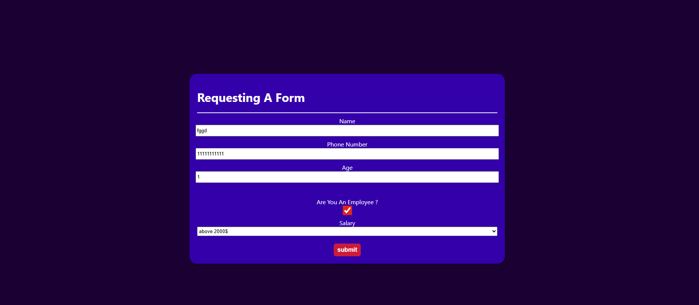

# Loan Eligibility Form

A simple React application that simulates a loan request form with validation and modal feedback.

## 🌐 Live Demo
[Click Here]( https://sherift911.github.io/Props-Practice-Project/)

## 📸 Preview




## 🚀 Features
- Controlled form inputs using React useState
- Real-time form validation
- Error handling with modal popup
- Clean and responsive UI

## 🛠️ Tech Stack
- React
- CSS

## 📋 Validation Rules
- Age must be between 18 and 100
- Phone number must be between 10 and 12 digits
- All fields are required

## 📦 Installation

```bash
npm install
npm start
